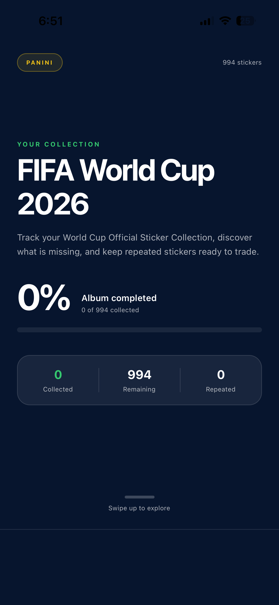
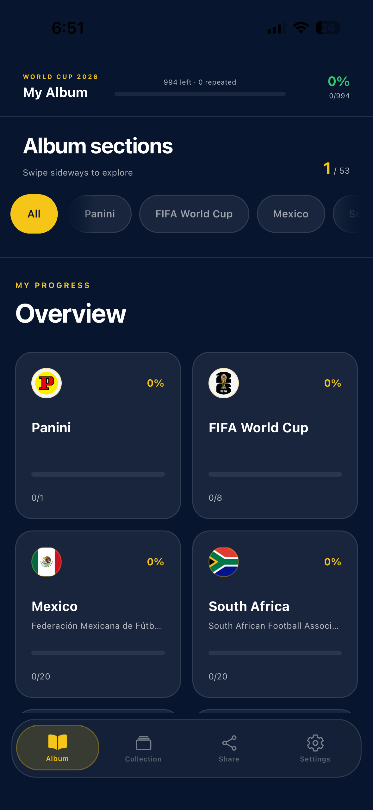
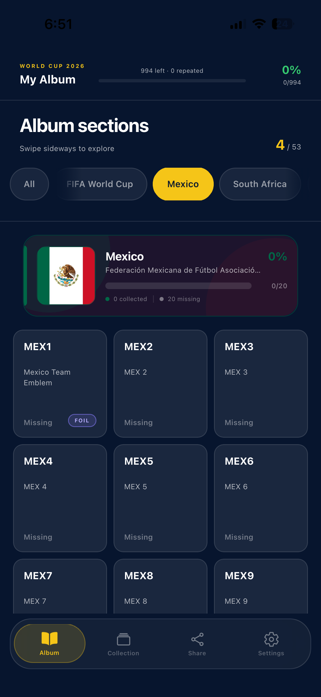
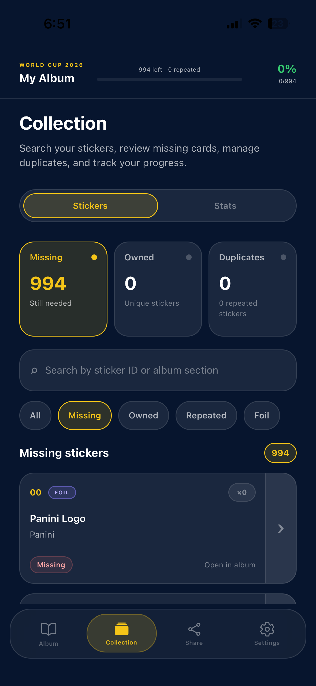
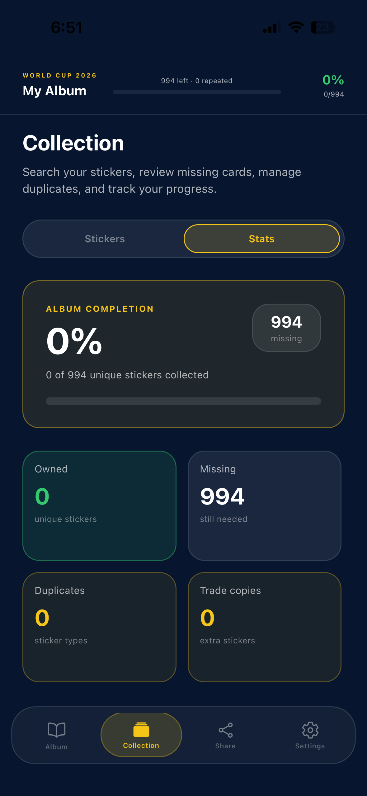
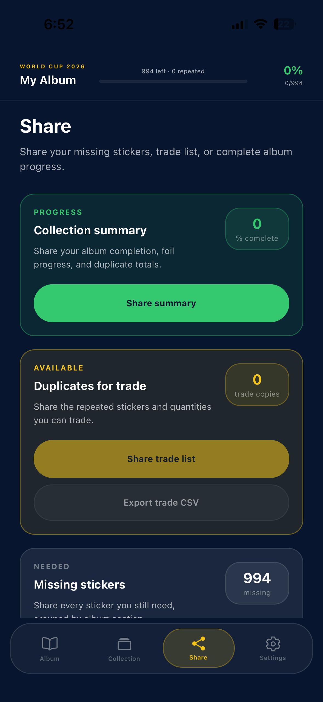
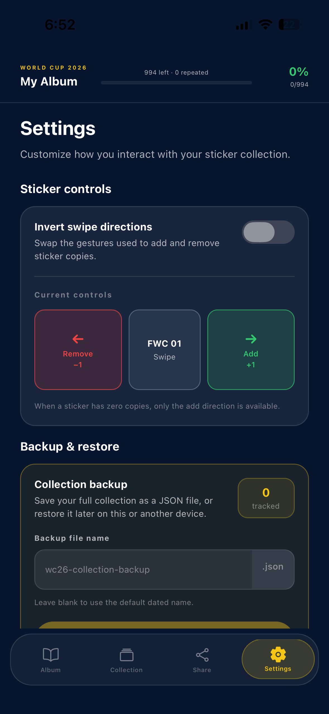

# WC26 Sticker Tracker

A polished mobile companion app for tracking a World Cup 2026 sticker album collection.

The app helps record owned stickers, duplicates, missing stickers, and completion progress across the entire album. 
It includes section-based navigation, swipe interactions, collection statistics, country-themed visuals, backup, 
restore tools, and completion celebrations.

> IMPORTANT 
> 
> This is an independent fan-made project. It is not affiliated with, endorsed by, or sponsored by Panini, FIFA, or any national football federation. All trademarks, team names, logos, and related intellectual property belong to their respective owners.

---

## App Preview

Add your screenshots to `assets/readme/` and replace the placeholders below.

### Album

<!-- Replace with your screenshot -->
<p align="center">
    
    
<<<<<<< Updated upstream
    
=======
    
>>>>>>> Stashed changes

</p>


### Collection

<!-- Replace with your screenshot -->
<p align="center">
  

</p>

### Share

<!-- Replace with your screenshot -->
<p align="center">
<<<<<<< Updated upstream
  
=======
  
>>>>>>> Stashed changes
</p>

### Settings

<!-- Replace with your screenshot -->
<p align="center">
  
</p>


---

## App Features

### Album tracking

- Track every sticker in the album
- Mark stickers as owned or missing
- Record duplicate copies
- View total album completion
- View completion by section and country
- See collected, missing, and repeated totals

### Fast sticker interactions

- Press, Hold and Swipe sticker cards to add or remove copies
- Optional inverted swipe directions
- Duplicate count displayed directly on cards
- Foil sticker indicators

### Album navigation

- Horizontal section selector
- Dedicated pages for album sections and national teams
- Smooth section paging
- Preserved scrolling and snap behavior
- Section progress cards with team artwork and federation details

### Country styling

- Country-specific primary and secondary colors
- Reusable centralized section color configuration
- Matching accents, borders, glows, and progress styling

### Completion experience

- Section completion detection
- Country-colored glow animation
- Light sweep effect
- Success haptic feedback

### Collection tools

- Search the collection
- Filter stickers by status
- View quick collection summaries
- Sort and review section progress
- Identify missing and repeated stickers

### Data and settings

- Local collection persistence
- Export collection backups
- Import and restore backups
- Validation for imported backup files
- Adjustable app preferences
- Safe-area-aware layouts
- iOS and Android support

---

## Tech Stack

- [Expo](https://expo.dev/)
- [React Native](https://reactnative.dev/)
- [TypeScript](https://www.typescriptlang.org/)
- [Expo Router](https://docs.expo.dev/router/introduction/)
- [React Native Reanimated](https://docs.swmansion.com/react-native-reanimated/)
- [React Native Gesture Handler](https://docs.swmansion.com/react-native-gesture-handler/)
- [Expo Haptics](https://docs.expo.dev/versions/latest/sdk/haptics/)
- [Expo File System](https://docs.expo.dev/versions/latest/sdk/filesystem/)
- [Expo Document Picker](https://docs.expo.dev/versions/latest/sdk/document-picker/)
- [Expo Sharing](https://docs.expo.dev/versions/latest/sdk/sharing/)

---

## Requirements

Before starting, install:

- Node.js 20 or newer
- npm
- Expo CLI through `npx`
- Xcode for iOS development
- Android Studio for Android development
- Git

Check your versions:

```bash
node --version
npm --version
git --version
```

---

## Installation

Clone the repository:

```bash
git clone <your-repository-url>
cd panini-wc26-tracker
```

Install dependencies:

```bash
npm install
```

Start the Expo development server:

```bash
npx expo start
```

From the Expo terminal:

- Press `i` to open the iOS Simulator
- Press `a` to open an Android emulator
- Scan the QR code with Expo Go when supported by the project configuration

---

## Running on iOS

<<<<<<< Updated upstream
=======
### Option 1: Expo Go

Install the **Expo Go** app from the App Store on your iPhone.

Start the development server:

```bash
npx expo start --clear
```

Make sure your computer and iPhone are connected to the same Wi-Fi network, then scan the QR code shown in the terminal or Expo Dev Tools.

You can also press:

```text
i
```

to open the project in the iOS Simulator when Expo Go is available there.

> Expo Go is convenient for quick testing, but some native modules or custom native configuration may require a development build instead.

### Option 2: Native iOS build

>>>>>>> Stashed changes
Install CocoaPods when needed:

```bash
npx pod-install
```

Run the native iOS project:

```bash
npx expo run:ios
```

<<<<<<< Updated upstream
To open a specific simulator:
=======
To open a specific simulator or connected device:
>>>>>>> Stashed changes

```bash
npx expo run:ios --device
```

---

<<<<<<< Updated upstream
## Running on Android

Start an Android emulator, then run:

```bash
npx expo run:android
```

Make sure Android Studio and the Android SDK are configured correctly.

---

=======
>>>>>>> Stashed changes
## Project Structure

```text
panini-wc26-tracker/
├── app/
│   ├── (tabs)/
│   ├── _layout.tsx
│   └── ...
├── assets/
│   ├── images/
│   └── readme/
├── components/
│   ├── album/
│   │   ├── navigation/
│   │   ├── overview/
│   │   ├── screen/
│   │   ├── section/
│   │   └── sticker/
│   ├── search/
│   └── ui/
├── constants/
│   ├── sectionColors.ts
│   └── theme.ts
├── context/
├── data/
│   └── albumCatalogue.ts
├── hooks/
├── services/
│   └── stickerStorage.ts
├── types/
│   └── album.ts
├── utils/
│   ├── albumSectionArtwork.ts
│   └── stickerState.ts
├── app.json
├── package.json
└── tsconfig.json
```

---

## Core Data Model

The album catalogue is defined with JSON in:

```text
data/albumCatalogue.ts
```

Primary album types are defined in:

```text
types/album.ts
```

Collection data is stored as a sticker ID to copy-count mapping:

```ts
type StickerCollection = Record<string, number>;
```

Example:

```ts
const collection = {
  "BRA1": 1,
  "BRA2": 0,
  "BRA3": 2
};
```

Meaning:

- `BRA1`: owned once
- `BRA2`: missing
- `BRA3`: owned with one duplicate

---

## Country and Section Colors

Reusable section colors are stored in:

```text
constants/sectionColors.ts
```

Each country can define:

```ts
createSectionColors(
  primaryColor,
  secondaryColor
);
```

Example:

```ts
BRA: createSectionColors(
  "#009C3B",
  "#FFDF00"
);
```

## Collection Backup and Restore

The settings area supports exporting and importing collection data.

Backup parsing and validation are handled in:

```text
services/stickerStorage.ts
```

A valid backup should contain the collection data in the expected format. Invalid files should be rejected without overwriting the current collection.

Recommended user flow:

1. Open Settings
2. Export collection backup
3. Save or share the generated file
4. Select Import backup when restoring
5. Review the parsed backup
6. Confirm replacement of the local collection

---

## Type Checking

Run:

```bash
npx tsc --noEmit
```

The command should finish without errors before creating a release build.

---

## Expo Project Health

Run:

```bash
npx expo-doctor
```

Resolve dependency, configuration, and native compatibility warnings before deployment.

---

## Troubleshooting

### Metro cache issues

```bash
npx expo start --clear
```

### TypeScript appears stale

In VS Code:

```text
Command Palette → TypeScript: Restart TS Server
```

Then run:

```bash
npx tsc --noEmit
```

### Native project is out of sync

```bash
npx expo prebuild --clean
```

Be careful: `--clean` regenerates native projects and may remove manual native changes.

### Require-cycle warning

Keep shared data and resolver utilities outside component folders when possible.

For example:

```text
utils/albumSectionArtwork.ts
constants/sectionColors.ts
```

This reduces circular imports between album components.

---

## Roadmap

The current version is complete for local collection tracking.

Possible future additions:

- Cloud synchronization
- User accounts
- Shared collections
- Trading lists
- Friend comparisons
- Collection analytics
- Push notifications
- Multiple album support
- Camera-based sticker scanning
- Store release automation

---

## Contributing

Contributions, suggestions, and bug reports are welcome.

Recommended workflow:

```bash
git checkout -b feature/your-feature
git add .
git commit -m "feat: describe your change"
git push origin feature/your-feature
```

Then open a pull request.

---

## Versioning

This project follows semantic versioning:

```text
MAJOR.MINOR.PATCH
```

Example:

```text
1.0.0
```

Suggested first stable release:

```bash
git tag v1.0.0
git push origin v1.0.0
```

---

## License

Add your chosen license here.

Common options:

- MIT
- Apache 2.0
- GPL-3.0
- Proprietary / All Rights Reserved

Example:

```text
MIT License
```

Be careful not to grant rights over third-party trademarks, logos, artwork, or copyrighted album data that you do not own.

---

## Acknowledgements

Built with Expo, React Native, and TypeScript.

Football competition names, album names, national-team branding, federation names, and related visual assets remain the property of their respective owners.
